# Intercept: Notification & Call Filtering Suite

Intercept is a privacy-first, ultra-minimalist digital wellbeing application. It is designed to intercept, schedule, and hold notifications and phone calls, delivering them in batches at user-defined intervals to protect focus and mitigate attention fragmentation. 

The system operates as a hybrid architecture:
1. **Next.js PWA Frontend (`/interface`)**: A mobile-optimised, dark-mode-first Progressive Web Application dashboard used to configure rules, define schedules, and manage the notification registry (The Vault).
2. **Android Background Bridge (`/android-bridge`)**: A native Android background suite using a Room SQLite database, implementing a `NotificationListenerService` and a `CallScreeningService` to intercept alerts at the operating system level.

---

## Technical Architecture

The following diagram illustrates the relationship between the Progressive Web App UI, the native Android Services, and the shared SQLite database:

```mermaid
graph TD
    subgraph PWA_Frontend ["Next.js Web App / PWA"]
        UI["Dashboard / UI Config"]
        LS[("Local Storage")]
        UI -->|Saves state locally| LS
    end

    subgraph Native_Android_Bridge ["Android Background Suite"]
        NLS["InterceptListenerService<br>NotificationListenerService"]
        CSS["InterceptCallScreeningService<br>CallScreeningService"]
        DB[("Room Database")]
        
        NLS -->|Diverts notification| DB
        CSS -->|Evaluates caller SIM rule| DB
    end

    subgraph Hardware_API ["Android OS Integration"]
        NotifAPI["StatusBarNotification API"] --> NLS
        CallAPI["Telecom Inbound Call details"] --> CSS
        SubMgr["SubscriptionManager SIM detection"] --> NLS
    end

    classDef orange fill:#ff5500,stroke:#ff5500,color:#fff;
    classDef dark fill:#09090b,stroke:#27272a,color:#e4e4e7;
    classDef db fill:#18181b,stroke:#27272a,color:#e4e4e7;

    class UI,NLS,CSS,SubMgr orange;
    class LS,DB db;

    style PWA_Frontend fill:#09090b,stroke:#27272a,stroke-dasharray: 5 5;
    style Native_Android_Bridge fill:#09090b,stroke:#27272a,stroke-dasharray: 5 5;
    style Hardware_API fill:#09090b,stroke:#27272a,stroke-dasharray: 5 5;
```



---

## Directory Structure & Core Files

### 1. PWA Interface (`/interface`)
*   **`src/app/`**: Next.js App Router folders.
    *   `layout.tsx`: Root HTML wrapper, initializes Geist typography, global styles, and the GDPR Cookie Banner.
    *   `page.tsx`: Landing page rendering the `InterceptDashboard` and PWA installation prompts.
    *   `apps/page.tsx`: The **App Rules** configuration matrix.
    *   `vault/page.tsx`: **The Vault** page displaying held notification history.
    *   `help/page.tsx` & `user-guide/page.tsx`: In-app instructions and reference guides.
    *   `terms/`, `privacy/`, `cookies/`, `accessibility/`: Legal compliance pages.
*   **`src/components/`**: Reusable React UI elements.
    *   `InterceptDashboard.tsx`: Main screen featuring the animated branding video, sound toggles, and engine state.
    *   `HamburgerMenu.tsx`: Slide-out panel container for the Master Engine control, schedule preset options, and navigation links.
    *   `CookieBanner.tsx`: GDPR-compliant cookie consent banner.
    *   `InstallPWAButton.tsx`: Prompt wrapper for browser installation options.
*   **`src/lib/interceptState.ts`**: Frontend State management. Synchronizes configurations, delivery schedules, and simulated alerts directly to the browser's `localStorage`.

### 2. Native Android Bridge (`/android-bridge`)
*   **`AndroidManifest.xml`**: Declares system permissions and binds the notification listener service.
*   **`InterceptListenerService.kt`**: Contains the Room SQLite entity declarations, DAOs, database instance generator, notification processing logic, and automatic SIM detection.
    *   `InterceptDatabase`: Defines tables for blocked notifications, rules, schedules, and active SIM parameters.
    *   `InterceptListenerService`: Extends `NotificationListenerService` to suppress system status bar notifications and store them locally.
    *   `InterceptCallScreeningService`: Extends `CallScreeningService` to intercept incoming calls, silences ringers, or blocks callers depending on the SIM rule.
*   **`notifications/`**: Contains baseline tutorial projects (`notifications-listener`, `notification-snoozer`, `notification-generator`) used as architectural references for native Android development.

---

## Core Features & System Operations

### 1. Notification Routing Matrix
The application handles routing logic on a per-app basis. The supported communication platforms are **Outlook**, **WhatsApp**, **Messenger**, **SMS**, and **Gmail**. For each application, users select from three routing options:

| Routing Mode | System Action | Notification Destination |
| :--- | :--- | :--- |
| **Always Allow** | Bypasses the filter. | Delivered directly to the Android System Tray. |
| **Always Block** | Instantly silenced. | Logged directly to **The Vault** as a blocked event. |
| **Postbox** | Intercepted and queued. | Held in **The Vault** for batch delivery on schedule. |

### 2. Postbox Scheduling & Batch Delivery
When an app is configured in **Postbox** mode, incoming alerts are systematically silenced and held in the Vault database. They are released in groups based on the scheduling engine:
*   **Scheduled Times**: Users can define precise, custom delivery hours and minutes.
*   **Quick Presets**:
    *   *Minimalist*: 2× daily (08:00 and 20:00).
    *   *Deep Work*: 4× daily (09:00, 13:00, 17:00, and 21:00).
    *   *Hourly Batch*: Every hour on the hour during workday hours (09:00 to 18:00).
*   **Deliver Now**: Trigger an immediate, manual batch release of all queued Postbox notifications to the system tray.

### 3. Dual-SIM Call Screening
To provide focus for work and personal phone lines on a single device, the Android bridge implements advanced call-blocking policies per SIM card:
*   **Auto SIM Detection**: Queries Android's `SubscriptionManager` at startup to register active SIM cards (e.g. SIM 1 / SIM 2) and map rules to their Subscription IDs.
*   **Call Rules Matrix**:
    *   `ALWAYS_ALLOW`: Call rings normally.
    *   `ALWAYS_BLOCK`: Call is rejected silently. The caller receives a busy/disconnected signal, and the call details are logged in the Vault.
    *   `POSTBOX`: Silences the ringer and forwards the caller to voicemail, logging the attempt in the Vault.

### 4. The Vault (Chronological Registry)
The Vault acts as a local repository of all notifications and calls that have been intercepted. 
*   **Release Alert**: Instantly forwards the individual alert back to the system tray.
*   **Delete & Clear**: Allows users to purge individual logs or wipe the entire database registry.

---

## Local Database Schemas (SQLite Room Entity)

The native Android bridge persists all app configurations and logs in a Room database containing the following tables:

### `blocked_alerts`
Stores the notification and call records intercepted by the background services.
```kotlin
@Entity(tableName = "blocked_alerts")
data class BlockedAlert(
    @PrimaryKey(autoGenerate = true) val id: Long = 0,
    val appPackage: String,       // e.g. "com.whatsapp" or "android.telecom.call"
    val title: String?,           // Message sender name or caller info
    val textBody: String?,         // Message content
    val timestamp: Long,          // Epoch millisecond timestamp
    val isReleased: Boolean = false // True if pushed to system tray
)
```

### `interception_rules`
Defines the current routing rule applied to each app package.
```kotlin
@Entity(tableName = "interception_rules")
data class InterceptionRule(
    @PrimaryKey val appPackage: String,
    val exclusionMode: String     // "ALWAYS_ALLOW", "ALWAYS_BLOCK", "POSTBOX"
)
```

### `delivery_schedules`
Defines the hours and minutes scheduled for batch postbox deliveries.
```kotlin
@Entity(tableName = "delivery_schedules")
data class DeliverySchedule(
    @PrimaryKey(autoGenerate = true) val id: Long = 0,
    val deliveryHour: Int,        // 0 to 23
    val deliveryMinute: Int,      // 0 to 59
    val isEnabled: Boolean = true
)
```

### `sim_rules`
Maps custom call handling rules to specific SIM slots identified by the device.
```kotlin
@Entity(tableName = "sim_rules")
data class SimRule(
    @PrimaryKey val subscriptionId: Int, // Android Subscription ID
    val simSlot: Int,                    // Slot index (0 = SIM 1, 1 = SIM 2)
    val displayName: String,             // Carrier name (e.g. "EE", "Vodafone")
    val callRule: String = "ALWAYS_ALLOW" // "ALWAYS_ALLOW", "ALWAYS_BLOCK", "POSTBOX"
)
```

---

## Compliance & Privacy Standards

*   **GDPR Compliance**: The interface incorporates a custom cookie banner that blocks analytical cookies until user consent is explicitly recorded.
*   **Local-Only Data Storage**: Both the PWA frontend (via `localStorage`) and the Android background service (via SQLite Room Database) operate with a strict **zero-cloud storage policy**. No notification data, message content, or call logs ever leave the user's device.
*   **Localization**: All user interface text, configuration rules, and help files strictly enforce UK English spelling conventions (e.g., *customise*, *optimised*, *customisation*).
